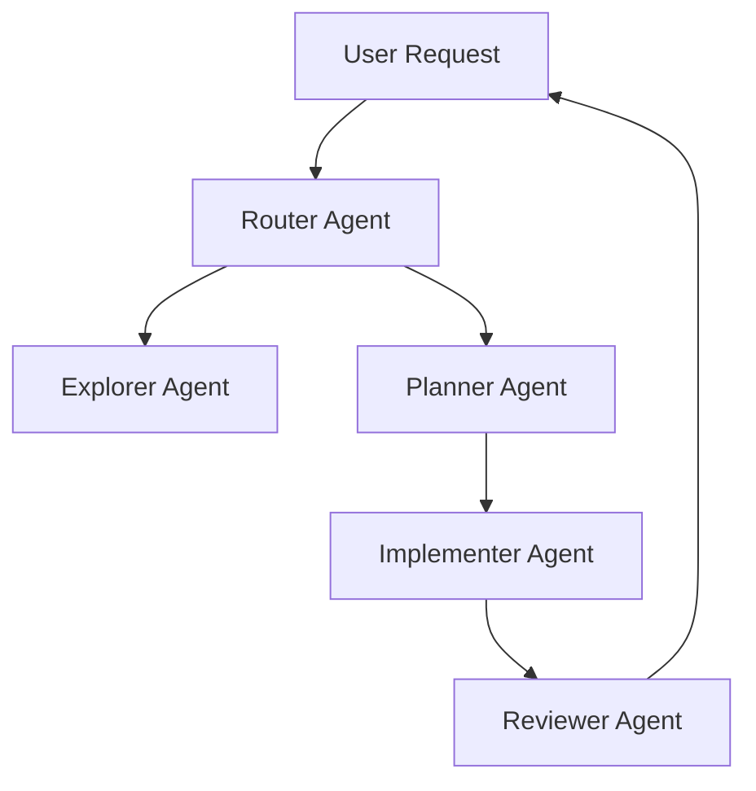

# 🤖 AI Project Template


A professional **AI-First software development template** designed to build applications using orchestrated AI agents and **Spec-Driven Development (SDD)**.

Instead of relying on long chat sessions with AI, this template introduces a **structured development workflow** where specialized agents collaborate through documents, tasks and contracts.

The developer remains the **architect and decision maker**, while AI agents assist with planning, coding and reviewing.

---

# 🚀 Why This Template Exists

Most developers interact with AI like this:

```
Ask AI → get code → fix problems → repeat
```

This often leads to:

- Loss of context
- Unstructured development
- Fragile architecture
- Difficult maintenance

This repository introduces a **structured AI development pipeline**:

```
Specification → Planning → Implementation → Review
```

AI agents collaborate using **documents instead of chat history**, which makes development more reliable and scalable.

---

# 🧠 Core Philosophy

AI should **not replace software engineering discipline**.

Instead, AI should operate inside a structured system where:

- Specifications define intent
- Agents execute tasks
- Humans validate architecture and decisions

This project demonstrates how to move from:

```
Chat-based coding → Structured AI-assisted engineering
```

---

# ⚙️ Multi-Agent Architecture



Each agent operates with **clear responsibilities and fresh context**, preventing context overload and improving reliability.

---

# 👥 Agent Roles

| Agent | Responsibility |
|------|----------------|
Router | Determines which agent should execute the request |
Explorer | Analyzes the codebase and gathers context |
Planner | Breaks features into structured tasks |
Implementer | Generates or modifies code |
Reviewer | Validates architecture, quality and security |
Architect | Maintains system architecture |
Spec Writer | Improves and refines specifications |

---

# 📂 Project Structure

```
ai-project-template
│
├── agents
│   ├── architect.md
│   ├── explorer.md
│   ├── planner.md
│   └── spec-writer.md
│
├── prompts
│   ├── router.md
│   ├── run-planner.md
│   ├── run-implementer.md
│   └── run-reviewer.md
│
├── contracts
│   ├── planner-contract.md
│   ├── implementer-contract.md
│   └── reviewer-contract.md
│
├── docs
│   ├── 01_SPEC.md
│   ├── 02_ARCHITECTURE.md
│   ├── 03_TASKS.md
│   ├── 06_CURRENT_SPRINT.md
│   └── WORKFLOW.md
│
├── skills
│   └── SKILLS_REGISTRY.md
│
├── AGENTS.md
├── ORCHESTRATOR.md
└── README.md
```

---

# 🧩 Development Workflow

This repository follows a **Spec-Driven Development pipeline**.

## 1. Define the Specification

Edit:

```
docs/01_SPEC.md
```

Define:

- Product requirements
- Business rules
- Constraints
- Expected behaviour

---

## 2. Plan the Work

The **Planner Agent** converts the specification into structured tasks.

Output file:

```
docs/03_TASKS.md
```

Example:

```
TASK-001 Create user model
TASK-002 Implement authentication endpoint
TASK-003 Add password hashing
TASK-004 Create authentication middleware
TASK-005 Add unit tests
```

---

## 3. Implement the Feature

The **Implementer Agent** reads:

```
docs/03_TASKS.md
docs/02_ARCHITECTURE.md
docs/06_CURRENT_SPRINT.md
```

Then generates the required code according to the architecture.

---

## 4. Review the Implementation

The **Reviewer Agent** validates:

- Architecture compliance
- Code quality
- Security issues
- Missing tests
- Scope alignment

If issues are detected, the task returns to implementation.

---

# 🔄 Example Workflow

Example request:

```
Add CSV export to reports
```

Planner output:

```
1. Create export endpoint
2. Generate CSV service
3. Add frontend button
4. Add tests
```

Implementer generates the code.

Reviewer validates architecture and security.

Feature approved and merged.

---

# 🛠 Compatible AI Tools

This template works with multiple AI-assisted development environments:

- OpenAI Codex
- Claude Code
- Cursor
- OpenCode
- VS Code AI assistants

---

# 🏁 Getting Started

Clone the repository:

```
git clone <repository-url>
```

Define the project specification:

```
docs/01_SPEC.md
```

Define system architecture:

```
docs/02_ARCHITECTURE.md
```

Start the workflow:

```
Router → Planner → Implementer → Reviewer
```

---

# 🎯 Who Is This For

This repository is designed for:

- Developers learning **AI-assisted development**
- Teams experimenting with **multi-agent workflows**
- Engineers exploring **Spec-Driven Development**
- Builders creating **AI-First software systems**

---

# 📜 License

MIT License